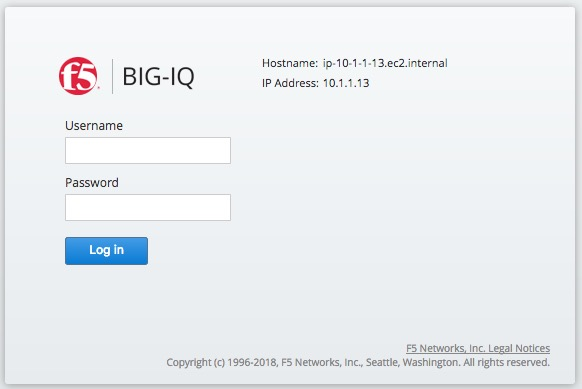

**Introduction**
--------------------

F5® BIG-IP® Cloud EditionTM was built to help network operations teams and applications teams collaborate more effectively in the rapid delivery of secure, appropriately supported applications. BIG-IP Cloud Edition simplifies and centralizes core device and app services management functions like setup, licensing, upgrades, analytics, and scaling. Operations teams can easily define a self-service catalog of application services that developers can then access, on demand, via a dashboard or API call. These services are defined, updated, and deployed for each application in contrast to the traditional, consolidated model in which a single Application Delivery Controller (ADC) supports multiple applications.

Customers can use BIG-IQ Centralized Management to create Auuto-Scaling BIG-IP VE devices in AWS cloud with service scaling group (SSG) which dynamically and autimatically delete or deploy BIG-IP VE devices as needed.

**The BIG­-IP Cloud Edition Architecture**
---------------------------
**Infrastructure Components**

1) BIG-IP Per-App virtual editions (VEs), each dedicated to a single application.

2) F5 BIG-IQ® Centralized Management which provides management, visibility, and licensing services across all instances—no matter where they are located.

**Logical Components**

1) Cloud providers - BIG-IP Cloud Edition supports deployment and auto scale of BIG-IP instances on the following cloud platforms:

* Amazon Web Services (AWS)
 
* VMware vCenter-based private clouds

2) Device templates - Device templates define all infrastructure-level characteristics (time zone, DNS, hostname, accounts, NTP, licensing, networking, etc.) that are required to deploy a BIG-IP device.

3) Service scaling groups (SSG) - When application services are deployed from an application template and a service scaling group is selected as the target, BIG-IP Cloud Edition manages the availability and elastic scaling of resources to deliver the services, plus manages the lifecycle and upgrade process for the BIG-IP devices delivering those services.

4) Application templates - Application templates define the application delivery and security services that will be deployed for an application, including all BIG-IP objects such as virtual servers, profiles, monitors, SSL certificates, security policies, etc.

**Deployment Process**

To start auto-scaling BIG-IP VE devices for application in AWS, you need to complete these procedures.

* Step 1. Set up AWS environment

* Step 2. Create device template for BIG-IP VE

* Step 3. Add cloud and environment to BIG-IQ

* Step 4. Create a service scaling group

* Step 5. Create service template

* Step 6. Addign permissions to users (option)

* Step 7. Create and deploy an application

**Deploy BIG-IP Cloud Edition in AWS**
----------------------------------------------
Customers can deploy BIG-IP Cloud Edition from scratch in AWS through subscribing F5 software appliances on AWS marketplace or use BIG-IP Cloud Edition Trial Quick Start which is an AWS CloudFormation Template (CFT) created by F5 to allow customers to experience the solution in an automation way. 
In order to reduce human errors and minimize the time to deploy, we will use CloudFormation template as example to explain each step in the later chatper. 

**BIG-IP Cloud Edition Trial Quick Start**

To deploy the BIG-IP Cloud Edition Trial Quick Start in AWS, check the link below.
<https://github.com/f5devcentral/f5-big-ip-cloud-edition-trial-quick-start>

This CloudFormation Template (CFT) creates two BIG-IQ VE instances: a BIG-IQ CM instance to configure and orchestrate instances of BIG-IP VE, and a BIG-IQ Data Collection Device (DCD) to store analytics data. The CFT also creates an Apache demo web server.
Enter the service page of CloudFormation and verify the bigiqCmUrl showed on the Outputs tab.

SSH to BIG-IQ VE instance and create an admin user password for web access.

	1. Type "modify auth password admin"
	2. Type new password
	3. Confirm new password
	4. Type "save sys config"
	

Open BIG-IQ login page and enter username as "admin", password as you typed above. 

**Configuration**
--------------------------------------

**Step 1. Set up AWS environment**

The full access permissions you need to be granted are Auto Scale Groups, Instances, SQS, S3, CloudWatch, and CloudFormation. Additionally, you need list, create, and delete permissions for the IAM role/rolePolicy/InstanceProfile.

1) VPC Configurations

* Create VPC with 2 subnets in different AZs and unique CIDR
* Create Internet gateway and attach it to VPC
* Create route table for each subnet with default route
	
2) Create a key pair to allow SSH access

3) Create a security group to protect the elastic load balancer

4) Create a classic elastic load balancer (ELB) as tier1 service scaler to distribute requests from Internet to BIG-IP VE of SSG.

	1. ELB Type: Classic Load Balancer
	2. Health Checks: 
       * Ping protocol:TCP
       * Ping port: 22
       * Timeout: 5 seconds
       * Interval: 30 seconds
	3. EC2 Instances: Enabled Cross-Zone Load Balancing and Connection Draining at 300 seconds.
	4. Edit the ELB listeners to remove the default listener (Load Balancer Protocol and Instance Protocol of HTTP on port 80).

**Step 2. Create device template for BIG-IP VE**

1) At BIG-IQ page, click **Devices** then, on the left, click **DEVICE TEMPLATES**.

2) Click **Create** button.

3) Name the template, click **Add/Remove** button and select AWS as "Provider Type".

4) Leave the **Configuration** as blank and **User Account** as default value, configure **DNS&NTP** with apporpriate value. 

**Step 3. Add cloud and environment to BIG-IQ**

1) At the top of the screen, click **Applications** then, on the left, click **ENVIRONMENTS** > **Cloud Providers**.

2) Click **Create** button.

3) From the **Provider Type** list, select AWS. Type your Access Key ID and Secret Access Key , and then click Test to confirm your connection.

4) Activate BYOL licenses. At top of the screen, click **Devices** > **LICENSE MANAGEMENT** > **Licenses**.

5) Click **Add License** button. Type a name to identify this license. Type your license key in **Base Registration Key** field and **Add-on Keys** field.

6) For the Activation Method setting, select **Automatic**.

7) At the top of the screen, click **Applications** then, on the left, click **ENVIRONMENTS** > **Cloud Environments**.

8) Click **Create**. The Create Application screen opens. Type and select appropriate values as follow.
	
1. Name: your_environment_name
2. Description: your_description
3. Device Template: device template you created in Step 2
4. Region: The AWS region you deployed for this quick start
5. VPC: VPC you crreated for this environment
6. Availability Zone Subnets: The subnets defined for this VPC are listed under Available
7. Restricted Source Address: The CIDR range you allow to access this SSG
8. SSH Key Name: EC2 Key pair
9. Services to Deploy: F5 services you want to deploy on SSG (LTM/ASM/AVR)
10. License Type: BYOL or Utility
11. AMI Image: Select the latest version
12. Instance Type: EC2 instance type for SSG

_If you selected BYOL, supply the following information_
	
13. BIG-IQ IP Address: Type BIG-IQ IP address
14. BIG-IQ User: Type "admin"
15. BIG-IQ Password: Type admin password
16. BIG-IQ License Pool Name: Type license name you input on 5)
17. Offering Name: leave as blank
18. Unit of Measure: Hourly

**Step 4. Create a service scaling group**

1) Click **Applications** > **ENVIRONMENT** > **Service Scaling Groups** > click **Create** button

2) Type the name and description. Select **Cloud Environment** you craeted in Step 3. 

3) Type the minimum and maximum number of BIG-IP VE you want running

4) Define the **Scale-Out** and **Scale-In** policy

5) Leave the cooldown period as default 15 minutes

6) Define **Health Status Rules** for **Notifications**  

**Step 5. Create service template** 

1) Click **Applications** > **SERVICE CATALOG** > clone default template **Default-AWS-f5-HTTPS-WAF-lb-template**

2) Name your service template

3) Click service template name you just created

4) Keep **PROPERTIES** as default, you can configure each object under **LOCAL TRAFFIC**. We will configure **Virtual Servers** to demostrate how service template works.

5) Click **Virtual Servers** > click the name of virtial server template (ex: Demo-AWS-HTTPS-WAF-LTM_default_vs).

_Note: A Service Template is a baseline for creating a new application. This allows you to maintain a consistent environment. Parameters that you define as editable are visible and can be revised. Using that template, and without having a lot of network expertise, the application manager can deploy the application objects you want by simply specifying a few key values._

6) Check **Editable** box in the right hand side of **Description** and **State(on BIG-IQ)**. Click the **Preview** in the upper right corner to see what the user interface look like when someone uses this template to deploy an application. You can also configure **Pools**, **Nodes**, etc. but we will keep it as default.

**Step 6. Addign permissions to users (option)**

1) Click **System** > **USER MANAGEMENT** > **Users**, click **Add** button.

2) Select **Auth Provider** as local, type **User name**, **Full Name**, **Password** and **Confirm Password**. Click **Save&Close**.

3) Click **ROLE MANAGEMENT** > **Roles** > **CUSTOM ROLES** > **Application Roles** > **Add**

4) Type **Name** and **Description**, select the user you want to join to this role. Select **Templates** and **Service Scaling Group** you want this role access to.

5) Click **Save&Close** 

**Step 7. Create and deploy an application**

1) Click **Applications** > **APPLICATIONS** > **Create**.

2) Select **Template** you created in Step 5 and type the **Name** and **Description**

3) Create AWS ELB(classic) as tier1 load balancer, copy and past ELB DNS name to **Domain Names** 

4) Select **Service Scaling Group** and group name you created in Step 4

5) Change AWS ELB Setting as follow

6) Leave others setting as default and click **Create**

7) After application was successfully created, you can see the dashboad in **APPLICATIONS**

8) Copy and past the ELB DNS name to your browser, you will see the Ubuntu web page which was created by BIG-IP Cloud Edition Trial Quick Start.

9) Click you application (ex. Demo-Web), go through every tabs listed in the middle of the screen. You can observe the performance metrics from every perspective.

**Teardown the BIG-IP Cloud Edition Trial Quick Start**
------------------------------------------------------- 
1) Open BIG-IQ CM in a web browser, delete the application, under Applications tab > APPLICATIONS, select the application, then click Delete.

2) Delete the Service Scaling Group, under Application tab > ENVIRONMENTS > Service Scaling Groups, select the AWS SSG, then Delete.

3) Open the Cloud Formation Console and delete the stack.

4) Delete the AWS ELB created for this application

